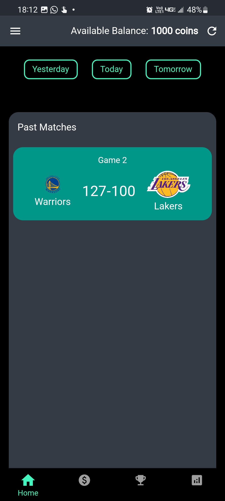

# CourtSide

CourtSide is a basketball match viewing and betting application that allows users to view ongoing, scheduled, and past basketball matches. The application also includes a betting feature that allows users to place bets on upcoming matches, as well as a leaderboard that shows the top winners.

## Getting Started

To use CourtSide, you'll need to have an account on the Sportradar API, which is where the application pulls its data from. You'll also need to have the latest version of the application installed on your device.

## Features

### View Matches

With CourtSide, you can view ongoing, scheduled, and past basketball matches. The application pulls data from the Sportradar API to provide up-to-date information on teams, scores, and schedules.

### Place Bets

CourtSide also allows users to place bets on upcoming matches. Users can select the match they want to bet on and the amount of their bet before placing their bet  using the application's built-in betting feature.

### Leaderboard

The leaderboard feature in CourtSide shows the top 10 winners of all bets placed on the platform. Users can view the leaderboard to see who is currently in the lead and how much they have won.

## API Integration

CourtSide integrates with the Sportradar API to pull data on their NBA basketball matches. This integration allows the application to provide real-time information on teams, scores, and schedules.

## Contact

If you have any questions or concerns about CourtSide, please contact us at yuvaraj@besquare.com.

# Screenshot from CourtSide application

1.Sign In and Sign Up Page: 

2.Closed Game Detail: 

3.Scheduled Game: 

4.Betting Function: 

5.Confirm Betting Amount: 

6.Betting Page (Shows ongoing and past bets): 

7.Leaderboard:

8.Log Out: 

Video Demonstration:

